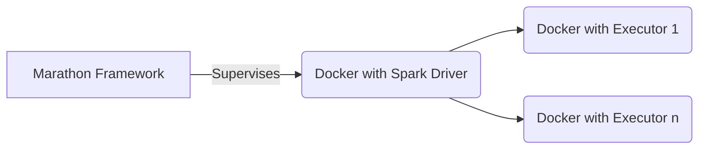

# Welcome to StackEdit!

Simple spark streaming, reading form kafka and insert/delete into Cassandra

- Spark 2.1.0
- Spark Kafka integration 0.8.2.11
- Scala 2.11.8
- Spark Cassandra Connector 2.0.7

Spark streaming is executed by marathon. Marathon use a custom docker image (builded with docker push). Spark driver is launched inside the docker in client mode. Marathon continuously check docker container contains the Spark driver 

## Running

>#create JAR package
> $ mvn clean package 
> #build custom image
> docker build -f Dockerfile --force-rm -t "artifacts.ath.bskyb.com:5001/skydap/eu_portability_identity_listener" . 
>#push the image to remote repository 
>docker push artifacts.ath.bskyb.com:5001/skydap/eu_portability_identity_listener
>replace some tag image with the following string into marathon.json
>sed -i 's#"image":.*#"image": "artifacts.ath.bskyb.com:5003/skydap/eu_portability_identity_listener_dev",#g' marathon_dev.json
>sed -i 's#\<env\>#test#g' marathon_dev.json
>sed -i 's#\<name_job\>#identity-listener#g' marathon_dev.json 
>#deploy marathon app 
>$JENKINS_HOME/bin/serviceAddOrUpdateV2.sh dev-uk marathon_dev.json

## architecture

And this will produce a flow chart:

